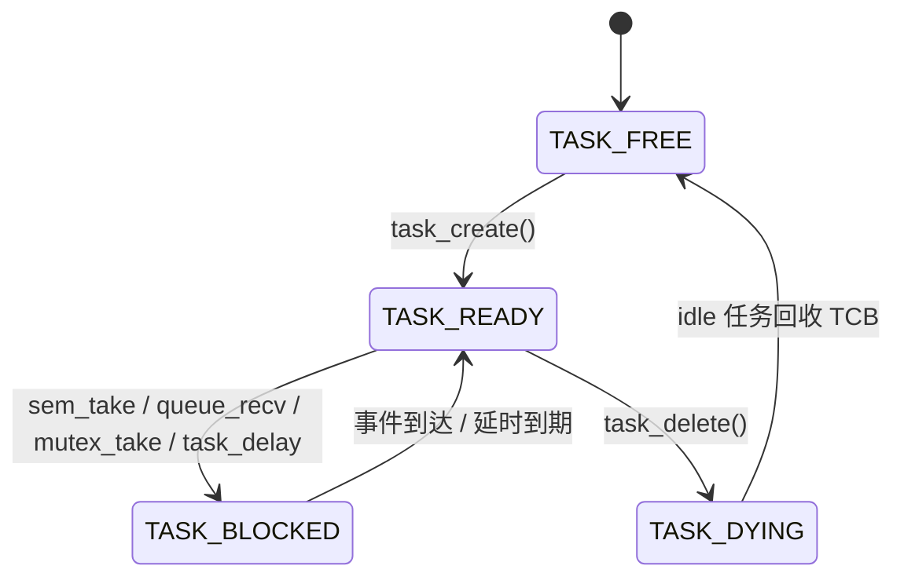

<div align="center">

# TinyRTOS

**从零手写的小型抢占式实时操作系统内核**

`STM32F407VGT6` · `Cortex-M4` · `GCC / CMake` · `~700 行纯手写内核`

[](https://www.st.com/en/microcontrollers-microprocessors/stm32f407vg.html)
[](#功能一览)
[](#快速上手)
[](https://github.com/1919884213/TinyRTOS/actions/workflows/build.yml)
[](LICENSE)
[](#设计亮点)

</div>

---

一个不依赖任何 RTOS 库、从调度器到上下文切换全部手写的微型内核，跑在 STM32F407VGT6 上。目的不是替代 FreeRTOS，而是把教科书里的每个概念——**就绪位图、PendSV、BASEPRI 临界区、优先级继承**——真正落成能烧进板子的代码。

> 📦 实测规模（含 5 组演示与 HAL）：**FLASH 11 KB / RAM 12.6 KB**（F407 的 1.05% 与 9.66%，RAM 大头是 5 × 2 KB 静态任务栈）

## 功能一览

| 模块 | 能力 | 实现要点 |
|:---:|---|---|
| ⏱️ 调度 | 抢占式优先级调度 + 同级时间片轮转 | 32 位就绪位图，`31 - __builtin_clz()` 单指令找最高优先级 |
| 🔄 上下文切换 | PendSV 异常中保存/恢复现场 | 纯汇编 `switch.s`，压栈 R4~R11 + LR/PC/xPSR |
| 🧵 任务管理 | 创建 / 自删除 / 外部删除 / yield | 静态 TCB 池，删除后由 idle 回收槽位 |
| 🔒 临界区 | 进出临界区保护 | `BASEPRI` 屏蔽内核中断，不关用户中断 |
| 🚦 信号量 | P/V 操作、阻塞唤醒 | 等待队列挂起/精确唤醒 |
| 📬 消息队列 | 定长消息 FIFO | 环形缓冲，满则阻塞发送者 |
| 🗝️ 互斥锁 | 递归加锁 + **优先级继承** | holder 计数，防优先级反转与死锁 |
| 💤 低功耗 | idle 任务 `__WFI()` 停等中断 | 无任务可跑时 CPU 自动休眠 |
| 🕐 时基 | SysTick 1 ms tick | `os_tick()` 驱动延时倒计时与时间片 |

## 任务状态机



## 设计亮点

<details open>
<summary><b>🧮 O(1) 就绪位图调度器</b></summary>

不用遍历就绪链表，一个 `uint32_t` 位图记录 0~31 级优先级的占用情况，`highest_prio()` 用 `__builtin_clz` 反斜引导令一条指令定位最高就绪任务——优先级语义反转（数值越大越高）也在同一处收口。

</details>

<details open>
<summary><b>🛡️ BASEPRI 临界区，而不是 `__disable_irq()`</b></summary>

内核临界区只把 SysTick/PendSV/SVC 抬到屏蔽线以上（`KERNEL_BASEPRI = 0x80`），**用户外设中断照常响应**——调度被保护，串口和传感器不会被内核"顺关"。

</details>

<details open>
<summary><b>📈 优先级继承</b></summary>

低优先级任务持锁时，高优先级任务来抢锁会临时把持有者的 `cur_prio` 抬到请求者等级（`prio_change()` 同步迁移就绪队列位置并悬起 PendSV），释放时逐级还原；等待者直接获得锁交接，不发生二次竞争。继承逻辑由编译宏 `MUTEX_INHERIT` 开关，注释掉即可对比"开/关继承"下的优先级反转现象。

</details>

<details>
<summary><b>🗑️ 自删除两阶段回收</b></summary>

`task_delete()` 不直接释放 TCB（任务不能拆自己脚下正在用的栈），先标 `TASK_DYING` 切换走，idle 任务再清状态位归还槽位——`TASK_FREE` 可被后续 `task_create()` 复用。

</details>

## 目录结构

```text
Core/User/
├── app/
│   └── os_examples.c/.h    5 组可切换的功能演示
└── rtos/                   ← 内核全部源码（~700 行）
    ├── kernel.c/.h         调度器、任务创建/删除、时间片
    ├── tcb.h               TCB 结构与状态定义
    ├── switch.s            PendSV 上下文切换（ARM 汇编）
    ├── port.h              BASEPRI 临界区原语
    ├── sem.c/.h            信号量
    ├── queue.c/.h          消息队列
    └── mutex.c/.h          递归互斥锁 + 优先级继承
```

## 快速上手

**1️⃣ 选择演示**：编辑 `Core/User/app/os_examples.c` 顶部的宏：

| `DEMO_SELECT` | 演示内容 | 验证目标 |
|:---:|---|---|
| `1` | 任务延时 + 同优先级轮转 | tick 时基与时间片 |
| `2` | 信号量生产者/消费者 | 阻塞—唤醒链路 |
| `3` | 消息队列收发 | 环形缓冲与同步 |
| `4` | 两任务竞争互斥锁 | 优先级继承生效 |
| `5` | 任务删除与重建 | TCB 回收复用 |

**2️⃣ 构建烧录**：工具链需要 [arm-none-eabi-gcc](https://developer.arm.com/tools-and-software/open-source-software/developer-tools/gnu-toolchain) + CMake ≥ 3.22 + Ninja（`arm-none-eabi-` 在 PATH 中）。仓库自带 CI workflow，每次 push 都在 Linux runner 上全量编译 Release：

```powershell
cmake --preset Release         # 配置
cmake --build --preset Release # 产物: build/Release/TinyRTOS.elf / .bin
```

调试版换 `Debug`；烧录后串口输出走 USART1（波特率以 CubeMX 配置为准），复位看打印。

**3️⃣ 写自己的任务**：入口签名 `void (*)(void *)`，跑 `os_start()` 前用 `task_create()` 注册：

```c
void my_task(void *arg)
{
    (void)arg;
    while (1) {
        /* 任务工作 */
        task_delay(1000);   /* 让出 CPU 1 个 tick */
    }
}
```

## API 速查

```c
/* 内核 */
int  task_create(task_fn entry, void *arg, uint8_t prio);
void task_delete(tcb_t *task);      /* NULL = 删除自己 */
void task_delay(uint32_t ticks);
void os_yield(void);  void os_start(void);

/* 同步原语 */
void sem_init(sem_t *s, uint32_t n);   void sem_take(sem_t *s);   void sem_give(sem_t *s);
void queue_init(queue_t *q, void *buf, uint32_t msg_size, uint32_t size);
void queue_send(queue_t *q, const void *msg);  void queue_recv(queue_t *q, void *msg);
void mutex_init(mutex_t *m);   void mutex_take(mutex_t *m);   void mutex_give(mutex_t *m);
```

## 已知边界

刻意留下的学习边界，不是 bug，是 TODO：

- `MAX_TASKS = 5`（idle 占一个槽位），优先级 0~31 由位图天然封顶；同级轮转时间片默认 10 tick
- idle 任务是 app 层用 `task_create(idle_task, NULL, 0)` 注册的普通任务，内核不绑定回收策略——TCB 复位逻辑放在 idle 里，换实现即换 idle
- 任务栈固定 2 KB 静态分配，`printf` 大输出前先看一眼栈水位
- 外部 `task_delete()` 仅对 READY 任务安全；BLOCKED 任务还挂在对象等待队列上，需要先从等待链摘除
- `task_delay()` 自带临界区，外层不要再包一层
- 临界区内禁用 `HAL_Delay()`——它靠 tick 中断忙等，而 tick 恰好被 `BASEPRI` 屏蔽

## 与 FreeRTOS 的对照

| 概念 | FreeRTOS | TinyRTOS |
|---|---|---|
| 调度查找 | 优先级链表 + `listGET_OWNER_OF_HIGHEST` | 就绪位图 + `CLZ` |
| 上下文切换 | `portASM.S` (PendSV) | `switch.s` (PendSV) |
| 临界区 | `taskENTER_CRITICAL` (BASEPRI) | `KERNEL_BASEPRI` 同款思路 |
| 内存 | heap_1~5 可选 | 纯静态，零 `malloc` |
| 优先级继承 | `xQueueSemaphoreTake` 内嵌 | `mutex.c` 独立实现 |

## License

[MIT](LICENSE) — 随便用，注明出处即可。
